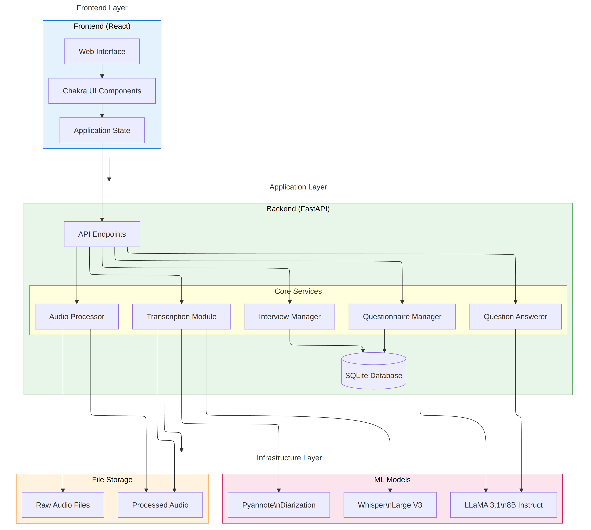

# EchoQuest


EchoQuest is a tool designed to streamline the process of conducting, transcribing, and analyzing semi-guided interviews. This application helps interviewers manage questionnaires, process audio recordings, generate transcriptions, and automatically answer predefined questions based on the interview content.


## Table of Contents
- [Features](#features)
- [Technologies Used](#technologies-used)
- [Prerequisites](#prerequisites)
- [Installation](#installation)
- [Usage](#usage)
- [Architecture](#architecture)
- [Contributing](#contributing)
- [License](#license)

## Features

- **Questionnaire Management**: Create, edit, and manage interview questionnaires.
- **Audio Processing**: Upload and process audio files for improved quality.
- **Automatic Transcription**: Generate accurate transcriptions from processed audio files.
- **Question Answering**: Automatically answer predefined questions based on the interview transcription.
- **Interview Management**: Organize and track multiple interviews and their progress.
- **User-friendly Interface**: Intuitive web-based interface for easy navigation and management.

## Technologies Used

- **Backend**: FastAPI (Python)
- **Frontend**: React with Chakra UI
- **Database**: SQLite with SQLAlchemy ORM
- **Audio Processing**: PyTorch, Torchaudio
- **Transcription**: Transformers (Whisper model)
- **Question Answering**: Custom LLM-based system

## Prerequisites
Before installing EchoQuest, ensure you have the following:

* Docker and Docker Compose installed on your system
* A GPU with at least 10GB VRAM
* At least 15GB of free disk space
* A Hugging Face account with access to the following models:
    * `meta-llama/Llama-3.1-8B-Instruct`: Used for question extraction and answering
    * `openai/whisper-large-v3-turbo`: Used for audio transcription
    * `pyannote/speaker-diarization-3.1`: Used for speaker diarization

You need to request access to these models on the Hugging Face website and obtain an API token.

## Installation

1. Clone the repository:
   ```
   git clone https://github.com/TobiFank/EchoQuest.git
   cd EchoQuest
   ```

2. Set up environment variables:
   Create a `.env` file in the backend directory with the following content:
   ```
   HF_TOKEN=your_huggingface_token_here
   ```
   Replace `your_huggingface_token_here` with your actual Hugging Face API token.

3. Start the application:
* For first-time setup:
  ```
  docker-compose up --build
  ```
  This will build the Docker images and start the containers.

* For subsequent starts:
  ```
  docker-compose up
  ```
  This will start the existing containers.

* To stop the application:
  ```
  docker-compose down
  ```

4. Once the containers are running, you can access the application at `http://localhost:3000`.

## Usage

### Creating a Questionnaire

1. Navigate to "New Questionnaire" in the sidebar.
2. Enter the questionnaire title and content.
3. The system will automatically extract relevant questions.


### Starting an Interview

1. Click on "New Interview" in the sidebar.
2. Select a questionnaire and enter interviewee details.
3. Upload audio file(s) of the interview.


### Processing and Transcribing

1. In the interview details page, click "Process Audio" to enhance audio quality.
2. After processing, click "Transcribe" to generate the interview transcription.


### Generating Answers

1. Once transcription is complete, click "Generate Answers" to automatically answer predefined questions.
2. Review the generated answers in the interview details page.


### Reviewing and Managing Interviews

- Use the dashboard to view all interviews and their statuses.
- Click on an interview to view details, edit metadata, or delete the interview.


## Architecture

EchoQuest follows a client-server architecture:

- **Frontend**: React-based single-page application
- **Backend**: FastAPI server handling API requests
- **Database**: SQLite database for storing questionnaires, interviews, and related data
- **Audio Processing**: PyTorch-based pipeline for enhancing audio quality
- **Transcription**: Utilizes the Whisper model for accurate speech-to-text conversion
- **Question Answering**: Custom LLM-based system for generating answers from transcriptions



## Contributing

Contributions to EchoQuest are welcome! Please follow these steps:

1. Fork the repository
2. Create a new branch: `git checkout -b feature/your-feature-name`
3. Make your changes and commit them: `git commit -m 'Add some feature'`
4. Push to the branch: `git push origin feature/your-feature-name`
5. Submit a pull request

## License
This project is licensed under a Custom Non-Commercial, Contribution-Based License.

### Key Points:
- **Private, non-commercial use** of this tool is permitted.
- **Modifications or enhancements** must be contributed to this project (e.g., through pull requests) to be approved by the project maintainer.
- **Commercial use** and creating derivative works for redistribution outside of this project are prohibited.
- **Contact for Commercial Use**: Companies or individuals interested in commercial use should contact Tobias Fankhauser on [LinkedIn](https://www.linkedin.com/in/tobias-fankhauser-b536a0b7) for case-by-case consideration.

For full details, please refer to the [LICENSE](LICENSE) file.

### Third-Party Licenses
This project uses various third-party models and libraries that are subject to their own licenses:
- **Llama model from Meta**: Refer to its [license terms on Hugging Face](https://huggingface.co/meta-llama).
- **Whisper model from OpenAI**: Refer to its [license terms on Hugging Face](https://huggingface.co/openai-whisper).
- **Speaker Diarization model from PyAnnote**: Refer to its [license terms on Hugging Face](https://huggingface.co/pyannote).

Please check each model's specific license terms for their usage restrictions.

## Contributing
We welcome contributions that enhance the tool! Please submit a pull request for any proposed changes or additions. All contributions must comply with the Custom Non-Commercial, Contribution-Based License outlined in the [LICENSE](LICENSE) file.

### Contributor License Agreement (CLA)
By contributing, you agree to the terms outlined in the [CLA](CLA.md). This agreement ensures that all contributions can be used in any future version of the project, including potential commercial versions. Please read the CLA before submitting your pull request.
